# Install i3wm (Improved Tiling WM) on Archcraft
{: .no_toc }

<details open markdown="block">
  <summary>
    Table of contents
  </summary>
  {: .text-delta }
1. TOC
{:toc}
</details>

[i3](https://i3wm.org/) is a dynamic tiling window manager inspired by wmii that is primarily targeted at developers and advanced users. The stated goals for i3 include clear documentation, proper multi-monitor support, a tree structure for windows, and different modes like in vim. 

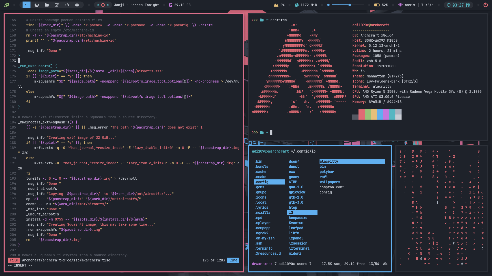

Let's install it on our Archcraft, We'll... as always, keep it minimal but visually stunning.

## Installation

Open the Terminal and run...

```bash
$ sudo pacman -Syyu
$ sudo pacman -S archcraft-i3wm
```

That's it! i3wm is installed on your Archcraft. Logout & login to i3wm, Here's how it looks...

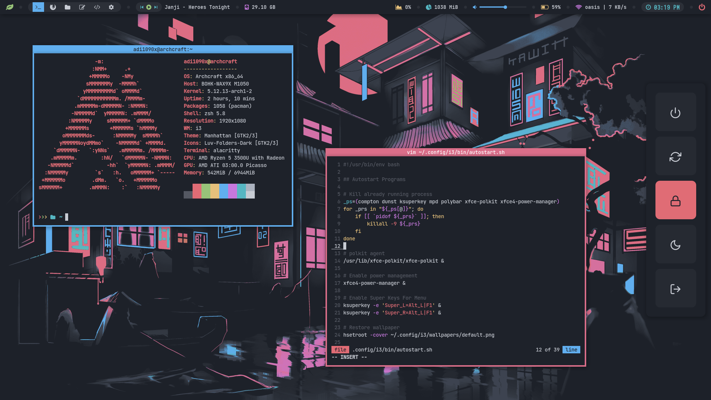

## Key Bindings

The <span class="label label-green">SUPER</span> or <span class="label label-green">WINDOWS</span> key is the default **Modkey**. Few important keybindings only, For all keybinding see **~/.config/i3/config** 

### Window Manager
{: .no_toc }

|Key|Action|
|:--|:--|
|<span class="btn btn-purple">W + C/Q</span>|Kill focused container|
|<span class="btn btn-purple">W + [1..9]</span>|Switch to workspace 1,2...9|
|<span class="btn btn-purple">W + Shift + [1..9]</span>|Move focused container to workspace 1,2...9|
|<span class="btn btn-purple">W + ⬅ / J</span>|Change focus to left container|
|<span class="btn btn-purple">W + ➡ / ;</span>|Change focus to right container|
|<span class="btn btn-purple">W + ⬆ / L</span>|Change focus to upper container|
|<span class="btn btn-purple">W + ⬇ / K</span>|Change focus to down container|
|<span class="btn btn-purple">W + Shift + ⬅ / J</span>|Move focused container to left|
|<span class="btn btn-purple">W + Shift + ➡ / ;</span>|Move focused container to right|
|<span class="btn btn-purple">W + Shift + ⬆ / L</span>|Move focused container to up|
|<span class="btn btn-purple">W + Shift + ⬇ / K</span>|Move focused container to down|
|<span class="btn btn-purple">W + H</span>|Split container in horizontal orientation|
|<span class="btn btn-purple">W + V</span>|Split container in vertical orientation|
|<span class="btn btn-purple">W + F</span>|Enter fullscreen mode for the focused container|
|<span class="btn btn-purple">W + S</span>|Change container layout to stacked|
|<span class="btn btn-purple">W + W</span>|Change container layout to tabbed|
|<span class="btn btn-purple">W + E</span>|Change container layout to toggle split|
|<span class="btn btn-purple">W + R</span>|Toggle Resize mode|
|<span class="btn btn-purple">W + M</span>|Toggle Move mode|
|<span class="btn btn-purple">W + Shift + G</span>|Toggle Gaps mode|
|<span class="btn btn-purple">W + Space</span>|Toggle between tiling / floating|
|<span class="btn btn-purple">W + Shift + Space</span>|Change focus between tiling / floating windows|
|<span class="btn btn-purple">W + Shift + R</span>|Restart i3wm inplace|
|<span class="btn btn-purple">W + Shift + C</span>|Reload the configuration file|

### Applications
{: .no_toc }

|Key|Action|
|:--|:--|
|<span class="btn btn-green">W + Return</span>|Open Terminal Emulator (alacritty)|
|<span class="btn btn-green">W + Shift + Return</span>|Open Floating Terminal Emulator (alacritty)|
|<span class="btn btn-green">W + Shift + F</span>|Open File Manager (thunar)|
|<span class="btn btn-green">W + Shift + E</span>|Open Text Editor (geany)|
|<span class="btn btn-green">W + Shift + W</span>|Open Web Browser (firefox)|

### Rofi Menus
{: .no_toc }

|Key|Action|
|:--|:--|
|<span class="btn btn-blue">Window</span>|Open Application Launcher|
|<span class="btn btn-blue">W + N</span>|Open Network Manager|
|<span class="btn btn-blue">W + X</span>|Open Power Menu|
|<span class="btn btn-blue">Control + Alt + M</span>|Open Music Menu|
|<span class="btn btn-blue">Control + Alt + N</span>|Open Internet Menu|
|<span class="btn btn-blue">Control + Alt + S</span>|Open Screenshot Menu|
|<span class="btn btn-blue">Control + Alt + R</span>|Open Apps as root Menu|
|<span class="btn btn-blue">Control + Alt + W</span>|Open Windows Menu|

## Customization

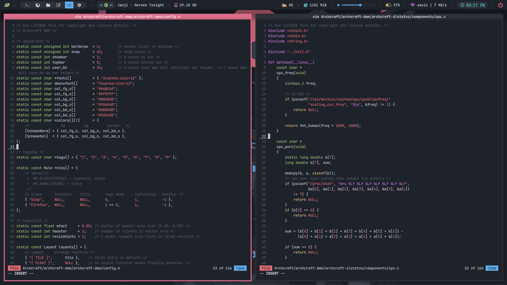

### Configurations
The default config file for i3wm is : `~/.config/i3/config`. See [Configuring i3](https://i3wm.org/docs/userguide.html#configuring) for details. 

### Startup Programs
Edit `~/.config/i3/bin/autostart.sh` script with your favorite text editor and add your startup programs (Make sure you add an '&' symbol at the end of the command) :

### Polybar
The polybar configuration files for this i3wm session are located at : `~/.config/i3/polybar`<br>
Edit, Modify according to your need and style.

### Rofi Menu
Rofi scripts and theme files are stored in `~/.config/i3/rofi`, Again... Edit / Modify them according to your need and style.

|App Launcher|Network Manager|Windows|
|:--:|:--:|:--:|
|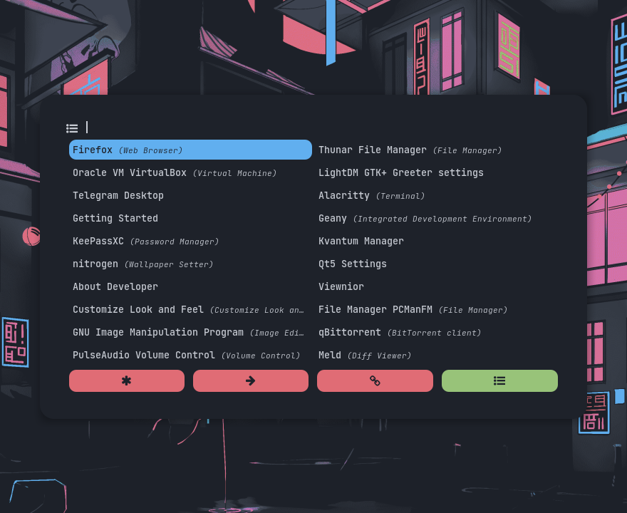|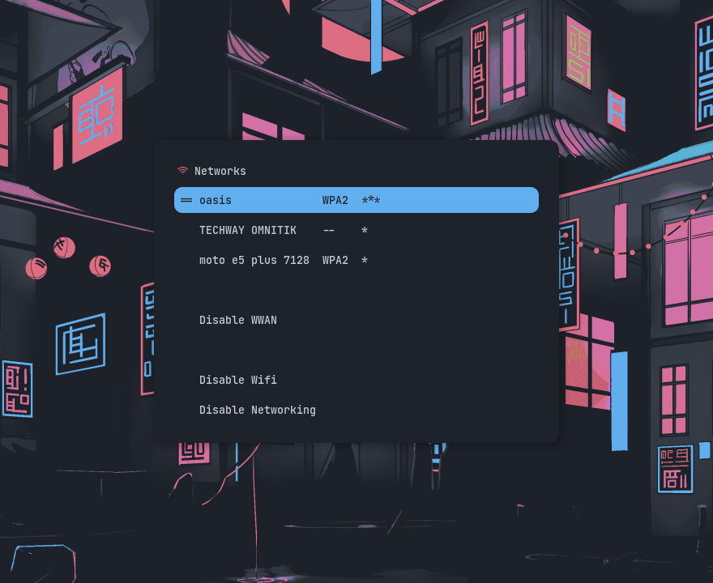|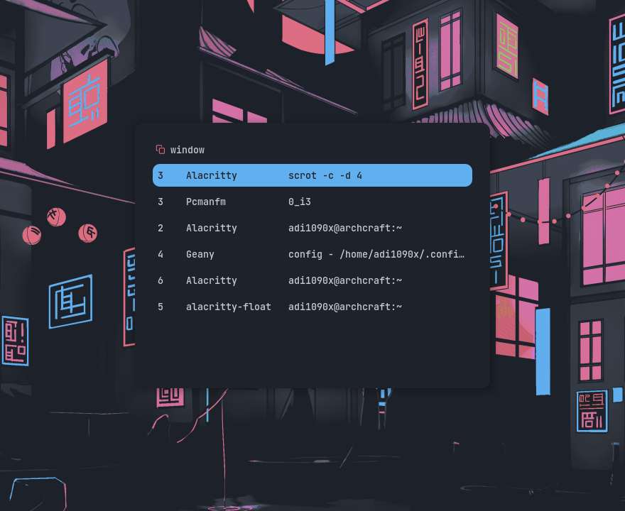|

|Apps As Root|Music (mpd)|Internet|
|:--:|:--:|:--:|
|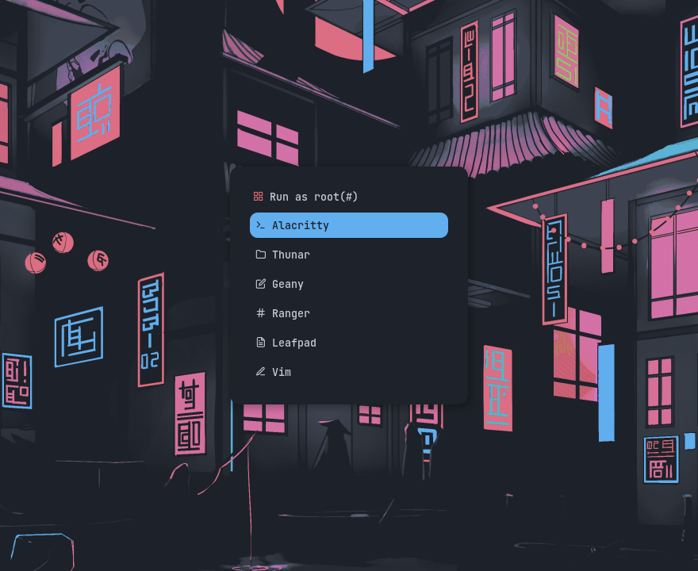|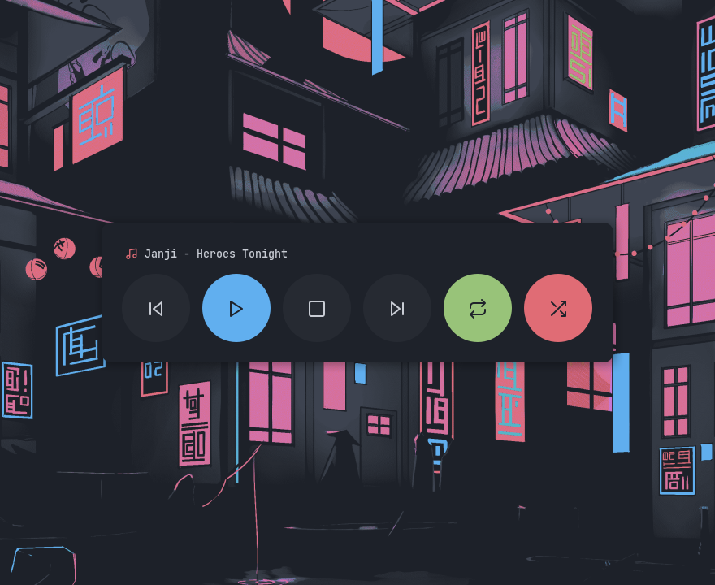|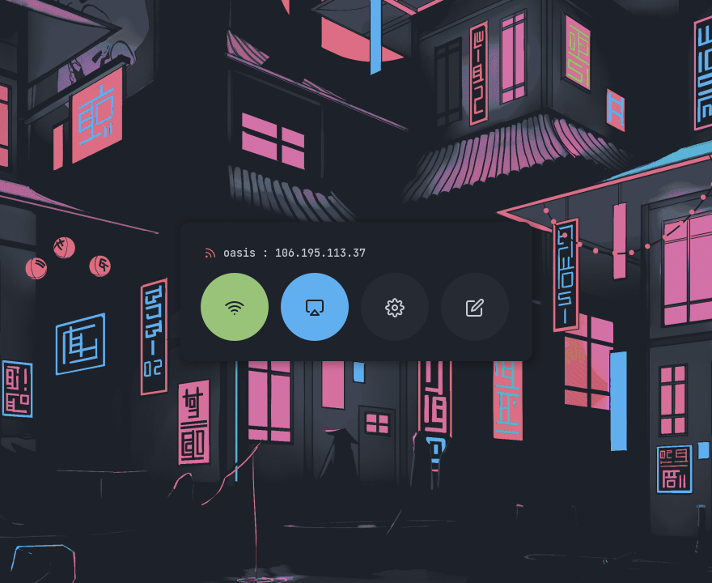|

|Powermenu|Screenshot|
|:--:|:--:|
|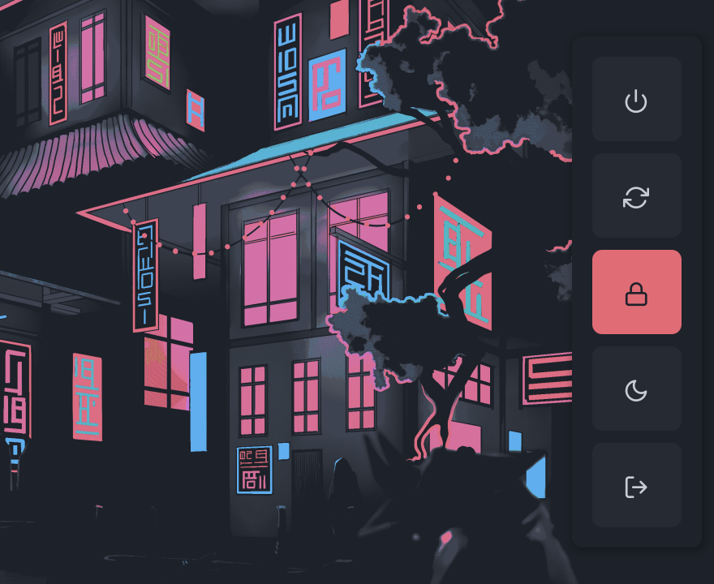|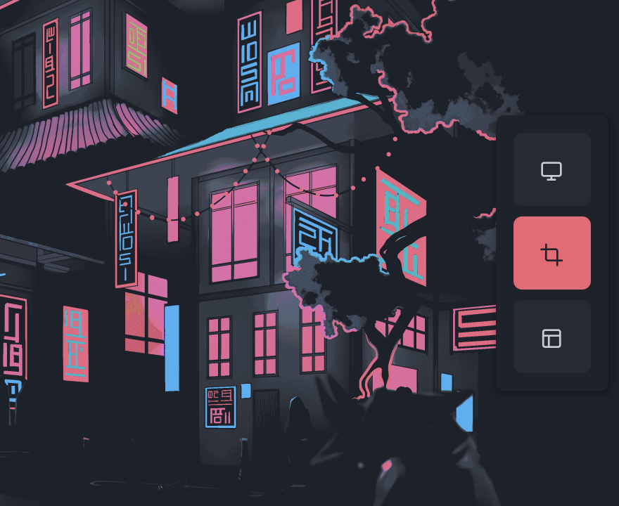|

### Wallpaper
Default wallpapers are stored in `~/.config/i3/wallpapers`. To change the wallpaper, Edit `~/.config/i3/bin/autostart.sh` and replace the image : 
```bash
# Restore wallpaper
hsetroot -cover ~/.config/i3/wallpapers/default.png
```

### Themes
No theme settings are supplied in the package, You manually have to apply gtk and icon theme with **lxappearance**. I'm using <span class="text-blue-100">Manhattan</span> gtk theme and <span class="text-blue-100">Luv-Folders-Dark</span> icon theme (already installed on Archcraft) in this setup.

That's it for now, Enjoy i3wm in Archcraft.
{: .fs-6 .fw-300 }
